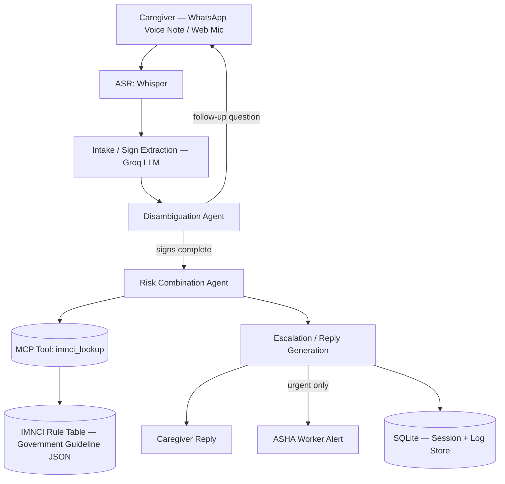
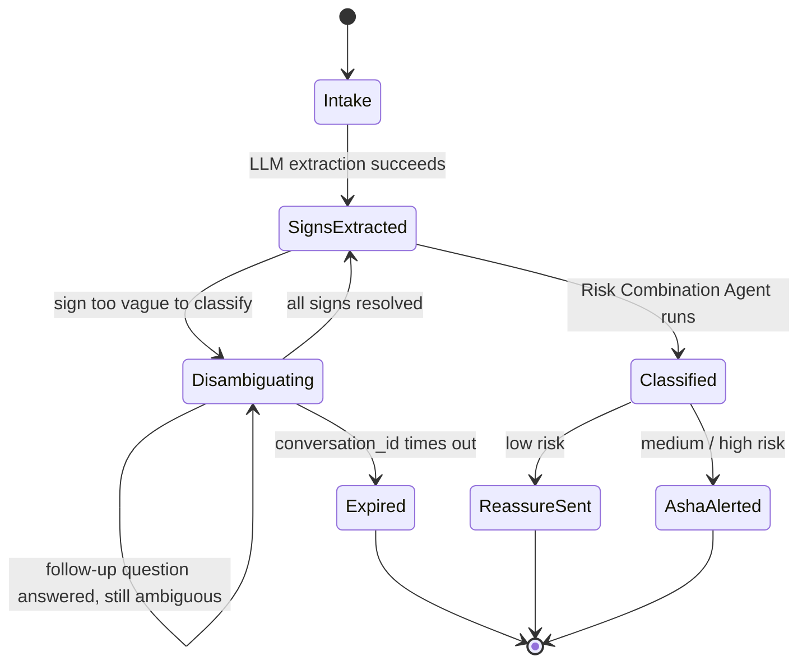
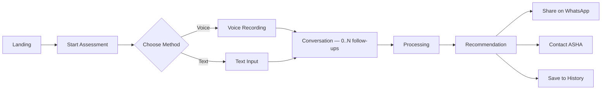

#  Naavya

**Voice-First Newborn Danger-Sign Triage Assistant — Hack4Humanity 2026**

Naavya is a voice-first, regional-language triage assistant that gives every rural caregiver the same combination-aware clinical judgment a trained health worker would apply — in the gap between scheduled newborn checkups, where danger signs are currently caught by memory alone.

> Describe it. Extract it. Classify it. Escalate it. Never miss a danger sign again.

---

##  Features

-  Voice-first intake — describe symptoms by speaking, in any regional language, no reading or app navigation required
-  LLM-based structured sign extraction (Groq / Llama 3.3 70B), constrained to the exact IMNCI schema
-  Resumable multi-turn disambiguation — targeted follow-up questions across separate HTTP requests via a `conversation_id`
-  Retrieval-grounded classification via a custom MCP tool (`imnci_lookup`) — never reasons clinically from model memory
-  Combination-aware IMNCI risk classification (possible bacterial infection, jaundice, dehydration/diarrhoea, feeding/weight problems)
-  Automatic ASHA worker escalation for genuinely urgent cases only — no alert fatigue
-  Every classification traceable to a specific IMNCI rule ID and government source document
-  WhatsApp Business Cloud API + web mic fallback, designed to sit behind an IVR number later
-  Bias/fairness test suite (11 checks) — demographic neutrality, determinism, source fairness, boundary consistency

---

##  Tech Stack

| Layer | Technology |
|---|---|
| ASR (Speech-to-Text) | OpenAI Whisper (local) |
| Sign extraction LLM | Groq — Llama 3.3 70B, schema-constrained JSON output |
| Orchestration | Custom MCP server (Model Context Protocol) |
| Backend API | FastAPI (Python) |
| Guideline data | Structured JSON, sourced from official IMNCI/HBNC government PDFs |
| Messaging channel | WhatsApp Business Cloud API + web mic fallback |
| Database | SQLite (PoC) → planned relational DB for production |
| Frontend | Web app (voice-first UI — see [Frontend](#-frontend)) |
| Bias/fairness testing | Custom test suite (11 checks) |
| Hosting | _TBD_ |

---

##  System Architecture



---

##  Pipeline Ownership

Voice or text input flows through five stages, each owned by one team member, connected by a shared JSON contract so every stage can be built and tested independently.

| Stage | Owner | Responsibility |
|---|---|---|
| ASR (Speech-to-Text) | Soham | Converts voice input (WhatsApp voice note or web mic) to text using Whisper |
| Intake / Sign Extraction | Soham (+ Kshitij design) | LLM-based (Groq) extraction of structured danger signs from free-form transcript, constrained to the exact IMNCI schema |
| Disambiguation | Shreeja | Asks targeted, plain-language follow-up questions for any sign too vague to classify confidently; resumable across separate HTTP requests |
| Risk Combination | Kshitij | Classifies structured signs against the IMNCI rule table via a retrieval-grounded MCP tool — never reasons clinically from model memory |
| Escalation | Shreeja | Generates the caregiver-facing reply and, for urgent cases only, an ASHA alert; computes follow-up scheduling |

>  A single HTTP request can't block and wait for a follow-up answer. NeoTriage handles this with a `conversation_id`-keyed session — the first response to an ambiguous input returns the ID plus a follow-up question; the next request, carrying that same ID, resumes disambiguation exactly where it left off rather than restarting sign extraction. Verified end-to-end on real audio and real LLM calls, across genuinely separate requests.

---

##  Conversation / Session Lifecycle



---

##  Clinical Grounding & Data Sources

All classification logic is derived from official Government of India clinical guidelines, not model knowledge:

- **IMNCI Chart Booklet for Medical Officers (2023 revision)** — Ministry of Health & Family Welfare / National Health Mission. Primary source for all danger-sign combination logic.
- **Home Based Newborn Care (HBNC) Operational Guidelines, Revised 2014** — National Health Mission. Source for the ASHA visit schedule and program scope.

Current scope covers the **"Sick Young Infant, age up to 2 months"** section only, across four assessment categories: possible bacterial infection, jaundice, dehydration/diarrhoea, and feeding/weight problems.

---

##  Core Modules

- **ASR** — Whisper-based speech-to-text for WhatsApp voice notes and web mic input
- **Intake / Sign Extraction** — schema-constrained LLM extraction of IMNCI danger signs from free-form, any-language transcripts
- **Disambiguation** — resumable, targeted follow-up questioning for ambiguous signs
- **Risk Combination** — MCP-tool-driven, retrieval-grounded IMNCI rule classification
- **Escalation** — caregiver reply generation + conditional ASHA worker alerting + follow-up scheduling
- **Bias/Fairness Suite** — 11 automated checks for demographic neutrality, determinism, source fairness, and boundary consistency

---

##  User Roles

| Role | Needs | How NeoTriage Serves Them |
|---|---|---|
| **Parent / Caregiver** | Knows something feels wrong but can't judge urgency; may be low-literacy; speaks a regional language | Calls/messages in their own language, gets a plain-language answer and next action |
| **ASHA Worker** | Covers many households, can't be everywhere between scheduled visits | Gets alerted automatically only on genuinely urgent cases, not every minor concern |
| **Health System / NGO** *(deployment path)* | Needs an auditable, guideline-grounded tool, not a black box | Every classification traces to a specific IMNCI rule ID and government source document |

>  This is not a diagnostic tool. It never outputs a diagnosis — only a referral recommendation to a human (ASHA worker or facility). It does not replace the HBNC visit schedule or ASHA workers; it augments the gap between visits.

---

##  Frontend

A voice-first web app, specified for direct build by AI frontend tools (Lovable, v0, Bolt) in the companion Frontend PRD. Design language: calm, spacious, conversational — closer to Google Health / Headspace than a clinical dashboard.

### Information Architecture

```
Landing (public)
├── About (public)
├── Login (public)
├── Register (public)
└── App shell (auth optional)
    ├── Home Dashboard
    ├── Start Assessment
    │   ├── Choose Method (Voice / Text / WhatsApp handoff)
    │   ├── Voice Recording
    │   ├── Text Input
    │   ├── Conversation (follow-up questions loop here)
    │   ├── Processing
    │   └── Recommendation
    ├── Assessment History (auth required)
    │   └── Assessment Detail
    └── Profile (auth required)
```

Authentication is **optional and never blocking** — a caregiver can go from Landing straight to a Recommendation without ever creating an account.

### Core User Flow



### Recommendation States

| State | Label | Color | Icon |
|---|---|---|---|
| 🟢 Low Risk | Continue Home Care | `color/success` `#2E7D32` | home / checkmark |
| 🟡 Medium Risk | Contact ASHA Worker | `color/warning` `#F9A825` | phone / person |
| 🔴 High Risk | Visit Hospital Immediately | `color/danger` `#D32F2F` | alert / hospital |

Risk is always communicated as **icon + label + color together** — never color alone.

### Screens

1. Landing
2. Login / Register
3. Home Dashboard (caregiver / guest / ASHA variants)
4. Assessment Selection (Voice · Text · WhatsApp)
5. Voice Recording
6. Conversation (multi-turn disambiguation thread)
7. Processing
8. **Recommendation** — the signature screen
9. Assessment History & Detail
10. Profile
11. About NeoTriage (trust & clinical safety content)

Full component library, design tokens, copy guidelines, accessibility, and empty/error-state specs live in the companion `NeoTriage_Frontend_PRD.md`.

---

##  Status — What's Built and Tested

| Component | Status | Note |
|---|---|---|
| IMNCI rule table | ✅ DONE | Clinically reviewed, 2 rounds of correction |
| MCP classification layer | ✅ DONE | 9/9 tests passing |
| Risk Combination Agent | ✅ DONE | 4 integration bugs found & fixed |
| Bias/fairness report | ✅ DONE | 11/11 checks passing |
| LLM-based intake (Groq) | ✅ DONE | Verified on real audio; fixed a real missed-danger-sign bug |
| Multi-turn disambiguation | ✅ DONE | Verified end-to-end on real audio and real LLM output |
| Escalation + reply generation | ✅ DONE | Tested for all three urgency paths |
| TTS (voice reply) | ✅ DONE (mock backend) | Full chain tested; real TTS model integration pending |
| WhatsApp integration | 🟡 PARTIAL | Webhook built; sandbox approval status pending |
| Database persistence | 🔴 OPEN | Session/log storage currently in-memory only |
| Frontend | 🔴 OPEN | Web mic UI not yet finalized |

---

##  Environment Variables

### Backend — create `.env` in `backend/`

```env
GROQ_API_KEY=
WHATSAPP_BUSINESS_TOKEN=
WHATSAPP_PHONE_NUMBER_ID=
DATABASE_URL=
PORT=
NODE_ENV=
```

### Frontend

No `.env` required for local dev unless the `/assess` API base URL is externalized — check the frontend API client config.

---

## ▶ Running Locally

```bash
# Backend
cd backend
pip install -r requirements.txt
uvicorn app.main:app --reload

# Frontend (in a separate terminal)
cd frontend
npm install
npm run dev
```

---

##  Known Risks & Limitations

| ID | Risk |
|---|---|
| **R1** | In-memory session storage does not survive a server restart and won't scale past a single process — flagged in code, planned to move to a real database. |
| **R2** | ASR/LLM extraction accuracy has not been benchmarked across all target regional languages and dialects — English and Hindi-adjacent phrasing tested; broader coverage still needed. |
| **R3** | The bias/fairness report covers the classification logic only, not the ASR layer or disambiguation comprehension across literacy levels — both are real, disclosed, unresolved bias surfaces. |
| **R4** | WhatsApp Business sandbox approval status is an external dependency outside the team's control. |
| **R5** | This is a decision-support prototype, not a validated clinical tool. A real pilot with ASHA and caregiver feedback would be required before any wider deployment. |

---

##  Success Metrics *(Post-Deployment, Illustrative)*

- Percentage of `refer_now` classifications that resulted in an actual facility visit
- False-reassurance rate: genuinely dangerous cases incorrectly classified as `reassure` (target: zero)
- Time from symptom onset to caregiver receiving guidance, vs. the wait-for-next-visit baseline
- ASHA worker alert precision — proportion of alerts reflecting genuinely urgent cases

---

##  Contributing

Contributions are welcome! Please open an issue to discuss significant changes before submitting a pull request.

1. Fork the repository
2. Create a feature branch (`git checkout -b feature/your-feature`)
3. Commit your changes
4. Open a pull request

---

##  License

MIT License — see [LICENSE](./LICENSE) for details.

---
